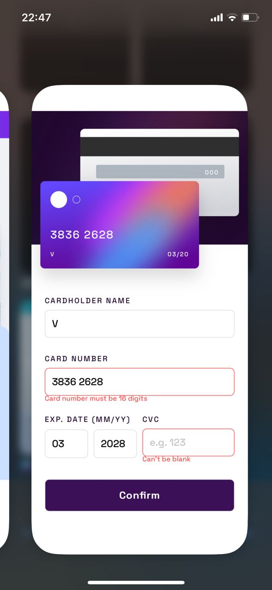

# Frontend Mentor - Interactive card details form (React Version)

This is a solution to the [Interactive card details form challenge on Frontend Mentor](https://www.frontendmentor.io/challenges/interactive-card-details-form-XpS8cKZDWw), built using React. Frontend Mentor challenges help you improve your coding skills by building realistic projects.

## Table of contents

- [Overview](#overview)
  - [The challenge](#the-challenge)
  - [Screenshot](#screenshot)
  - [Links](#links)
- [My process](#my-process)
  - [Built with](#built-with)
  - [What I learned](#what-i-learned)
  - [Continued development](#continued-development)
- [Author](#author)
- [Acknowledgments](#acknowledgments)

## Overview

### The challenge

Users should be able to:

- Fill in the form and see the card details update in real-time
- Receive error messages when the form is submitted if:
  - Any input field is empty
  - The card number, expiry date, or CVC fields are in the wrong format
- View the optimal layout for the interface depending on their device's screen size
- See hover, active, and focus states for all interactive elements on the page

### Screenshot

**Desktop View**


<br>

<details>
  <summary><strong>Click to expand: Mobile & Active States</strong></summary>
  <br>
  <table>
    <tr>
      <td></td>
      <td></td>
    </tr>
    <tr>
      <td></td>
      <td></td>
    </tr>
  </table>
</details>

### Links

- **Solution URL:** [GitHub repo](https://github.com/Victorbjay/my-interactive-card-react)
- **Live Site URL:** [Click here](https://my-interactive-card-react.vercel.app/)

## My process

### Built with

- Semantic HTML5 markup
- CSS custom properties and Flexbox/Grid for layout
- Mobile-first workflow
- **React** - JS library for building user interfaces
- **Vite** - Next Generation Frontend Tooling
- **React Hooks** (`useState`) for state management

### What I learned

Converting this project from vanilla JavaScript to React was a profound learning experience, highlighting the power of a declarative, component-based architecture.

The biggest takeaway was the shift in thinking from direct DOM manipulation to state-driven UI updates. Instead of manually finding and updating elements, I learned to manage all form data in a centralized state object using the `useState` hook. This "single source of truth" makes the entire application much easier to reason about.

```jsx
// Central state management in the main App component
const [formData, setFormData] = useState({
  name: "",
  number: "",
  month: "",
  year: "",
  cvc: "",
});
```

Another key learning was breaking the UI into reusable components (`<CardDisplay>`, `<CardForm>`, `<ThankYou>`). This made the code cleaner and more organized. I practiced passing state down as props and lifting state up via callback functions passed as props.

Finally, I implemented conditional rendering to switch between the form and the "Thank You" screen. This declarative approach is much cleaner than manually adding and removing CSS classes.

```jsx
// In App.jsx, switching views based on the `isSubmitted` state
{
  isSubmitted ? (
    <ThankYou onContinue={handleContinue} />
  ) : (
    <CardForm
      formData={formData}
      setFormData={setFormData}
      errors={errors}
      onSubmit={handleSubmit}
    />
  );
}
```

### Continued development

This project was the fulfillment of the "Continued development" goal from my original vanilla JS version. Now that I have successfully built an interactive application with React and managed its state with hooks, I plan to focus on these areas next:

1.  **Advanced State Management:** For larger applications, I want to explore more robust state management solutions like the **Context API** or **Redux Toolkit** to avoid "prop drilling."
2.  **Form Handling Libraries:** To further simplify the form logic, I will practice using libraries like **React Hook Form** or **Formik**, which can abstract away much of the boilerplate for validation and state handling.
3.  **Component Libraries:** I plan to integrate a component library like **Chakra UI** or **Material-UI** into a future project to build complex, accessible UIs more efficiently.

## Author

- **Website** - [Victor-Okpe](https://github.com/Victorbjay)
- **Twitter** - [@victorbjay](https://www.twitter.com/victorbjay)

## Acknowledgments

This project was completed as a collaborative effort with Google's Gemini assistant, using all I was taught at Altschool Africa to sharpen my frontend skills. The process involved a detailed, iterative approach to ensure the layout and functionality precisely matched the design brief.
